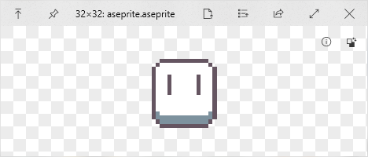

# QuickLook.Plugin.AsepriteViewer

## Image Cache 
`%temp%/quick-look-ase`

## Error: Default Open With？
Add your Aseprite.exe path to the file `%temp%/quick-look-ase/Config` or Set Default Open With.

## Download and Installation

1. Go to [Release page](https://github.com/NotFaceGUI/QuickLook.Plugin.AsepriteViewer/releases) and download the latest version.
2. Make sure that you have QuickLook running in the background. Go to your Download folder, and press <key>Spacebar</key> on the downloaded `.qlplugin` file.
3. Click the “Install” button in the popup window.
4. Restart QuickLook.
5. Select the file and press <key>Spacebar</key> `.ase` `.aseprite`.

## Thanks to

- [QuickLook.Plugin.ImageViewer](https://github.com/QL-Win/QuickLook/)
- [Aseprite](https://github.com/aseprite/aseprite)

## License

MIT License.
